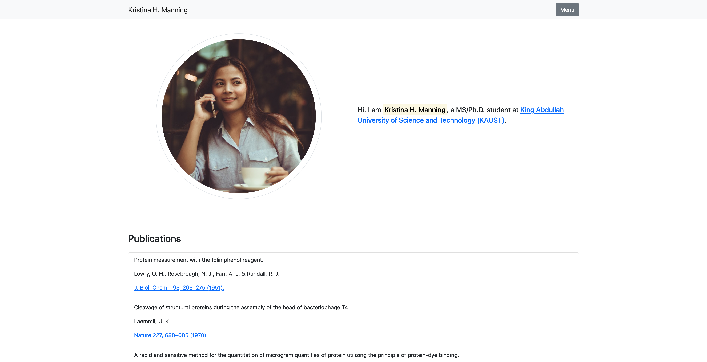

# Introduction

**Git** is a *distributed version control system* software for tracking changes in any set of files, usually used for coordinating work among programmers collaboratively developing source code during software development. On the other hand, **GitHub** is a cloud platform for software development and *version control* using Git (adapted from [here](https://en.wikipedia.org/wiki/Git) and [here](https://en.wikipedia.org/wiki/GitHub)).

<div class = 'space'></div>
## Installation

To download and install Git, refer to [https://git-scm.com/downloads](https://git-scm.com/downloads) (or [https://github.com/git-guides/install-git](https://github.com/git-guides/install-git)). And to verify if Git was successfully installed, type `git --version` on the terminal.

To create a GitHub account, go to [https://github.com/](https://github.com/), click on `Sign Up`, and follow the instructions.

<div class = 'space'></div>
# General Procedure

After navigating to the desired folder on the terminal using the `cd` command, and creating a local repository using the `git init` command, the general can be expressed through the following image (the below diagram was inspired by [this video](https://www.youtube.com/watch?v=3fUbBnN_H2c))

<div class = 'space'></div>


<div class = 'space'></div>

Meaning that we can use the `git add`, `git commit`, `git push`, and `git clone` commands to move files along compartments. Also, notice that the changes are tracked and saved in the **Commit history**.

<div class = 'space'></div>
# First steps

After installing Git, it is important to set an username and your email address (the same as from your GitHub account). To do this, on the terminal
```{bash, eval = FALSE}
git config --global user.name 'username'
git config --global user.email 'email@email.com'
```
Replacing `'username'` and `'email@email.com'` by the appropriate values.

And to check the values, one can use the following commands
```{bash, eval = FALSE}
git config user.name
git config user.email
```

Although the next step is not mandatory, it is a good practice to change the name of the main branch from `master` to `main`, (for consistency with GitHub guidelines). We can do this using the following command
```{bash, eval = FALSE}
git config --global init.defaultBranch main
```

<div class = 'space'></div>
## Creating your first repository

Let's create our first repository. To do this, on the terminal (if on Windows, the `cmd`), navigate to your `Desktop` directory, and create a new folder named `STAT294`. Depending on your directories structure, you can do this in the following way
```{bash, eval = FALSE}
cd ~/Desktop/
mkdir STAT294
cd STAT294
```

Finally, to create/initialize a repository, use the `git init` command. That is,
```{bash, eval = FALSE}
git init
```

To make sure that a repository was created, you can look for the `.git` folder by typing the `ls -a` command. On the other hand, if you want to delete the `.git` folder (and therefore, the repository settings), you can type `rm -rf .git`.

<div class = 'space'></div>
## Moving files to the Staging area

Now, let’s create some non-significant files on `/STAT294/`, so that we can see how to work with them. You can do this by typing `touch file1.R file2.R` (or you can create them manually). For this situation, we would have the following files structure

```{bash, eval = FALSE}
Desktop/
└── STAT294/
    ├── .git/
    ├── file1.R
    └── file2.R
```

To see these files' status, you can use the `git status` command.

Also, you can send a file (e.g., `file1.R`) to the **Staging area** with the `git add file1.R` command (to send all files at once, use `git add .`).

After doing this, run `git status` again.

You can remove a file (e.g., `file1.R`) from the **Staging area** with the `git rm --cached file1.R` command. After doing this, run the `git status` command one more time. 

Before going to the next subsection send all files to the **Staging area** with
```{bash, eval = FALSE}
git add .
```

<div class = 'space'></div>
## Creating commits

A **commit** can be seen as a *safe point*. Meaning that you can always refer back to them, if needed. To create a commit (based on the **Staging area**), use the following command
```{bash, eval = FALSE}
git commit -m 'meaningful but short message'
```

For example, you can start your list of commits with the following command
```{bash, eval = FALSE}
git commit -m 'initial commit'
```

You can check the status of your repository using the `git status` command. Also, to see the log of commits, use the `git log` command.

Now, modify `file1.R` and do all steps again. In particular, use the following commands
```{bash, eval = FALSE}
nano file1.R (to modify the file1.R)
git status
git add .
git status
git commit -m 'modify file 1'
git status
git log
```

To go back in time and revert your project to one of your safe points (i.e., to one of your previous commits), you can use the following commands
```{bash, eval = FALSE}
git log (and copy the commit key; e.g., 42037c4bf5c1fe189a62632b393f6971979d8bf4)
git revert --no-commit 42037c4bf5c1fe189a62632b393f6971979d8bf4..HEAD
git commit -m 'back to old version X'
```

Notice that there are different ways to do this (getting back to a point in the past), but **never** delete your history of commits. After all, that is the main reason why you should use Git: **for tracking your changes**.

If you want to visit older commits, use the `git checkout (commit key)` command. To come back, use the `git switch -` command.

<div class = 'space'></div>
## Pushing files to GitHub

Assuming you already have a GitHub account (if not, you can click [here](https://github.com/) to create one), we can [create a new repository **on Github**](https://github.com/new).

<div class = 'space'></div>


<div class = 'space'></div>

Now, since we want to “push an existing repository from the command line” (for example, the repository we have just created in `/stat294/`), all we need to do is
```{bash, eval = FALSE}
git remote add origin https://github.com/user/repository.git
git branch -M main 
git push -u origin main
```

However, there are a few important comments to be made.

1. In the first line, notice that `user` and `repository` have to be replaced by the appropriate values.
2. Recently, the default name of the main branch was modified from `master` to `main`, as in the second line. You can use the `git branch` command to verify the current name. Also, the second line may not be necessary if you already redefine your standard main branch name.
3. Using the `git push` command right away will likely lead to an error due to authentication issues. We will fix it now.

<div class = 'space'></div>
### SSH settings

Since it is no longer possible to connect to GitHub using just your username and password, we have to set a SSH (Secure Shell, which is a cryptographic network protocol) key.

To do this, based on [this guide](https://docs.github.com/en/authentication/connecting-to-github-with-ssh/generating-a-new-ssh-key-and-adding-it-to-the-ssh-agent), do the following.

1. On the terminal, enter the following command (replacing `email@email.com` by your email address).
```{bash, eval = FALSE}
ssh-keygen -t ed25519 -C 'email@email.com'
```
The above command will create a new SSH key using your email address as a label. As a remark, you can accept the default file location and create an empty password.
2. Now, you will add your SSH key to the ssh-agent. To do this, use the following command
```{bash, eval = FALSE}
eval "$(ssh-agent -s)"
```
3. The next step is to modify your `~/.ssh/config` file to automatically load keys into the ssh-agent. This can be done by using the following command 
```{bash, eval = FALSE}
open ~/.ssh/config
```
However, if such a file does not exist, it may be necessary to create it with
```{bash, eval = FALSE}
touch ~/.ssh/config
```
Finally, after opening your `~/.ssh/config` file, you can modify it by pasting the following lines
```{bash, eval = FALSE}
Host *
  AddKeysToAgent yes
  UseKeychain yes
  IdentityFile ~/.ssh/id_ed25519
```
4. Now you can add your SSH private key to the ssh-agent with
```{bash, eval = FALSE}
ssh-add -K ~/.ssh/id_ed25519
```
5. The final step is adding the newly created SSH key to your GitHub account. To do this, based on [this guide](https://docs.github.com/en/authentication/connecting-to-github-with-ssh/adding-a-new-ssh-key-to-your-github-account), copy the SSH public key to your clipboard with the following command
```{bash, eval = FALSE}
pbcopy < ~/.ssh/id_ed25519.pub
```
Now, on your GitHub profile, go to `Settings` → `SSH and GPC keys` and click on the `New SSH key` button.

On the new `SSH keys / Add new` page, paste your SSH public key into the `Key` field, and click on the `Add SSH key` button.

As a final comment, and as discussed in [this thread](https://gist.github.com/developius/c81f021eb5c5916013dc), if you try to use the `git push -u origin main` command and it still does not work, you may have to run the following line
```{bash, eval = FALSE}
git remote set-url origin git@github.com:user/repository.git
```

<div class = 'space'></div>
### Creating a README file

Since we did not create a `README.md` file, we can do it now. On the terminal, assuming the correct directory,
```{bash, eval = FALSE}
touch README.md
nano README.md
```
The second line allows you to edit the file using the `nano` text editor. Alternatively, you can use any other software to do this. Also, you can use the `markdown` language to format this document (the same as in `RMarkdown`).

Next, let's do the necessary steps to push this new change to our GitHub repository; that is,
```{bash, eval = FALSE}
git add README.md
git commit -m 'add readme file'
git push origin main
```

After doing this, check you repository page on GitHub!

<div class = 'space'></div>
## Pulling files from another repository

Now, suppose that you have to retrieve files from an existing repository. You can do this using the `clone` and `pull` commands. To do this, 

1. On GitHub, navigate to the desired repository (e.g., [this one](#)), go to `Code` → `HTTPS`, and copy the address (e.g., `https://github.com/user/repository.git`).
2. On the terminal, navigate to the desired folder using the `cd` command, and type
```{bash, eval = FALSE}
git clone https://github.com/user/repository.git
```

If the repository got updated and you want to incorporate these changes, you can use the `git pull` command. To check the linked remote repositories, you may use `git remote -v`; and if there are more than one, it may be necessary to specify it through the more complete (for example) `git pull origin` command. After getting a copy (of a repository that you own), **all other commands can be applied**.

<div class = 'space'></div>
# Creating a page with GitHub pages

Using the [GitHub Pages](https://pages.github.com/), it is possible to create a free web page with unique domain. For this tutorial session, we will use an [already created template](https://avramaral.github.io/blog_demo/), as in the below image.

<div class = 'space'></div>



<div class = 'space'></div>

To do this, take the following steps.

1. Using the terminal, navigate to the desired folder, and clone [this repository](https://github.com/avramaral/blog_demo).
```{bash, eval = FALSE}
https://github.com/avramaral/blog_demo.git
```
2. Modify the files in whatever way you want. Notice that this is a very simple static page with a single `.html` file. Much more complex static websites can be created. For instance, people use [Jekyll](https://jekyllrb.com/) as a static site generator. However, later in this course you will see how to create static web pages using `R` and `RStudio`. 
3. (**Optional**). As you do not own this repository, and you are using the corresponding files just to initialize your project, I suggest you not to keep the previous `.git/*` files, and start from scratch. To do this, you can simple delete the `.git/` folder as follows (provided you are already on the correct path)
```{bash, eval = FALSE}
rm -rf .git
```
4. To use it as your main page, it is **crucial** to create a GitHub repository named `username.github.io`, such that the `username` is replaced by the appropriate value.
5. After doing this, you can follow all the previously mentioned steps. That is, once in the correct folder,
```{bash, eval = FALSE}
git init
git add .
git commit -m 'initial commit'
git remote add origin https://github.com/user/user.github.io.git
git branch -M main (Optional!)
git remote set-url origin git@github.com:user/user.github.io.git
git push -u origin main
```
6. (**Optional**). As in [this thread](https://stackoverflow.com/questions/11577147/how-to-fix-http-404-on-github-pages), if you are facing a `HTTP 404` on GitHub Pages when everything looks correct, you may have to push an empty commit to make it work. You can do this in the following way
```{bash, eval = FALSE}
git commit --allow-empty -m 'Site rebuild'
git push -u origin main
```

<div class = 'space'></div>
# RStudio + Git & GitHub