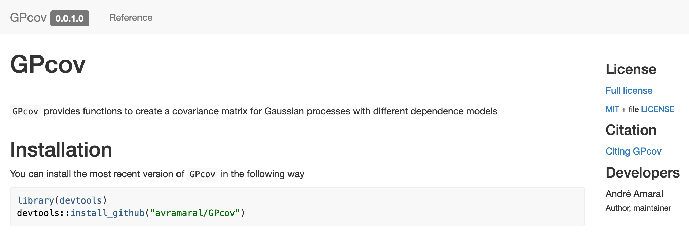

# Introduction

In this tutorial, we will create an `R` package ([`GPcov`](https://github.com/avramaral/GPcov/)) that computes the covariance matrix for Gaussian Processes with different dependence structures. Also, we will create a [website](https://avramaral.github.io/GPcov/) for our package using `pkgdown`. The image below shows an screenshot of our [packages' website](https://avramaral.github.io/GPcov/)

<div class = 'space'></div>



<div class = 'space'></div>


As a reference, for this tutorial, besides [Professor Paula's notes](https://www.paulamoraga.com/book-r/10-r-packages.html), I mostly used the [`R Packages` book](https://r-pkgs.org/), which is [freely available online](https://r-pkgs.org/).

<div class = 'space'></div>

# Creating a package project

To create the `R` package, we will use different tools (e.g., `roxygen2` for documentation); however, most of the desired functionalities are encapsulated into two packages, namely `usethis` and `devtools`. We only need to load `devtools`, though (since it calls `usethis` internally). If you do not have them installed, do it and load `devtools`.

```{r, eval = FALSE}
install.packages(c("devtools", "roxygen2"))

library("devtools")
```

The first step will be creating a project for our `R` package. We can do this with
```{r, eval = FALSE}
usethis::create_package(path = '~/Desktop/Project/GPcov') # Change the path!
```

Since a new `R` session has been initialized, you have to load the `devtools` library again.
```{r, eval = FALSE}
library("devtools")
```

Now, recalling that we want to have our project on GitHub (so people can use it), we will set a new Git repository and do an initial commit. This can be done using the following command
```{r, eval = FALSE}
usethis::use_git(message = 'initial commit')
```

If you are using RStudio and have to restart `R`, notice that we need to load `devtools` again.
```{r, eval = FALSE}
library("devtools")
```

At this point, we have the following file structure

```{bash, eval = FALSE}
GPcov/
├── .gitignore
├── .Rbuildignore
├── .Rhistory
├── DESCRIPTION
├── NAMESPACE
├── GPcov.Rproj
└── R/
    └── .
```

Now, we can start modifying the files.

<div class = 'space'></div>

# Initial settings

The first file we will change is `DESCRIPTION`. Here, we would like to describe our package's functionalities, so that other people may have a rough idea on how it works. For `GPcov`, I edited it in the following way (change it as per your convenience)

```{bash, eval = FALSE}
Package: GPcov
Title: Compute covariance matrix for Gaussian processes
Version: 0.0.1.0
Authors@R:
  person("André", "Amaral", , "avramaral@gmail.com", role = c("aut", "cre"))
Description: This package provides functions to create a covariance matrix for Gaussian processes with different dependence structures.
License: `use_mit_license()`, `use_gpl3_license()` or friends to pick a license
Encoding: UTF-8
LazyData: true
Roxygen: list(markdown = TRUE)
RoxygenNote: 7.1.2
```

After changing the `DESCRIPTION` file, let's try to check if our (empty) package is being correctly defined. To do this, we can use the following command

```{r, eval = FALSE}
devtools::check()
```

The (truncated) output was

```{bash, eval = FALSE}
> checking DESCRIPTION meta-information ... WARNING
  Non-standard license specification:
    `use_mit_license()`, `use_gpl3_license()` or friends to pick a
    license
  Standardizable: FALSE

0 errors ✓ | 1 warning x | 0 notes ✓
```

The above function, as the name suggests, check if there is any problem with our package code. And notice that we had a warning since we did not set a `License` for our project. Many options are available, but one alternative is running the following command
```{r, eval = FALSE}
usethis::use_mit_license()
```

Now, we can check our package code again. We expect no errors.

```{r, eval = FALSE}
devtools::check()
```

<div class = 'space'></div>

# Writing our `R` code

Our `R` code is very simple (see below), and the main function is `compute_cov_matrix()`. During the tutorial, I will briefly go through it. However, our main goal will not be discussing the code itself, but creating an `R` package based on it.

```{r, eval = FALSE}
library("GPBayes")

compute_distance <- function (p, q) {
  dim_p <- length(p)
  dim_q <- length(q)
  
  if (dim_p != dim_q) {
    stop("Points should have the same dimension.")
  } else {
    partial <- 0
    for (i in 1:dim_p) {
      partial <- partial + ((p[i] - q[i]) ^ 2)
    }
  }
  sqrt(partial)
}

white_noise <- function (p, q, sig2, a) {
  if (sum(p != q) == 0) {
    result <- sig2
  } else {
    result <- 0
  }
  result
}

brownian_motion <- function (p, q) {
  if (length(p) != 1) {
    stop("Brownian motion covariance function can only be computed for 'd = 1'.")
  } else {
    result <- min(p, q)
  }
  result
}

exponential <- function (p, q, sig2, beta) {
  if (is.null(beta)) { beta <- 1 }
  (sig2 * exp(-1 * compute_distance(p, q) / beta))
}

matern_model <- function (p, q, sig2, nu, beta) {
  if (is.null(nu)) { nu <- 1 } # Whittle covariance function
  if (is.null(beta)) { beta  <- 1 }
  dist <- compute_distance(p, q)
  if (sum(p != q) == 0) {
    result <- sig2
  } else {
    result <- ((sig2 / ((2 ^ (nu - 1)) * gamma(nu))) * ((dist/ beta) ^ nu) * GPBayes::BesselK(nu = nu, z = (dist / beta)))
  }
  result
}

compute_cov_function <- function (p, q, cov_func = "white_noise", arg) {
  if (is.null(arg[["sig2"]])) { sig2 <- 1 } else { sig2 <- arg[["sig2"]] }
  switch(EXPR = cov_func,
         white_noise = {
           cov_element <- white_noise(p = p, q = q, sig2 = sig2)
         }, brownian_motion = {
           cov_element <- brownian_motion(p = p, q = q)
         }, exponential = {
           cov_element <- exponential(p = p, q = q, sig2 = sig2, beta = arg[["beta"]])
         }, matern_model = {
           cov_element <- matern_model(p = p, q = q, sig2 = sig2, nu = arg[["nu"]], beta = arg[["beta"]])
         }, {
           stop("Select a valid covariance model.")
         })
  cov_element
}

compute_cov_matrix <- function (points, cov_func, ...) {
  arg <- list(...)
  
  if (!is.data.frame(points)) {
    stop("'points' should be a data frame with 'n' rows and 'd' columns.")
  } else {
    n <- nrow(points)
    
    cov_matrix <- matrix(data = NA, nrow = n, ncol = n)
    for (i in 1:n) {
      for (j in i:n) {
        cov_matrix[i, j] <- compute_cov_function(p = unlist(as.vector(points[i, ])), q = unlist(points[j, ]), cov_func = cov_func, arg = arg)
        cov_matrix[j, i] <- cov_matrix[i, j]
      }
    }
  }
  cov_matrix
}
```

Based on the above code, we will create the `.R` files so that we can write (copy/paste) our functions into the package project. To do this, we will use the `usethis::use_r()` function. Create the following files

```{r, eval = FALSE}
usethis::use_r(name = "compute_cov_matrix")
usethis::use_r(name = "compute_cov_function")
usethis::use_r(name = "utils")
usethis::use_r(name = "cov_models")
```

We will place the functions into the files as follows

```{r, eval = FALSE}
# FILE = compute_cov_matrix.R

compute_cov_matrix <- function (points, cov_func, ...) {
  # CONTENT
}
```

```{r, eval = FALSE}
# FILE = compute_cov_function.R

compute_cov_function <- function (p, q, cov_func = "white_noise", arg) {
  # CONTENT
}
```

```{r, eval = FALSE}
# FILE = utils.R

compute_distance <- function (p, q) {
  # CONTENT
}
```

```{r, eval = FALSE}
# FILE = cov_models.R

white_noise <- function (p, q, sig2, a) {
  # CONTENT
}

brownian_motion <- function (p, q) {
  # CONTENT
}

exponential <- function (p, q, sig2, beta) {
  # CONTENT
}

matern_model <- function (p, q, sig2, nu, beta) {
  # CONTENT
}
```

Notice that we did not have to load the `GPBayes` library into the `.R` files (using `library(GPBayes)`); however, for all functions imported from other packages, we have to make sure that we are also specifying their namespace, i.e., we have write `package::function()` when calling them (as we did with `GPBayes::BesselK()`).

Now, we can check our code.

```{r, eval = FALSE}
devtools::check()
```

**Remark:** if we hadn't written `GPBayes::BesselK()` when calling `BesselK()`, we would have seen a `note`:

```{bash, eval = FALSE}
> checking R code for possible problems ... NOTE
  matern_model: no visible global function definition for ‘BesselK’
  Undefined global functions or variables:
    BesselK

0 errors ✓ | 0 warnings ✓ | 1 note x
```

However, we still have a problem (in particular, a `warning`). As in the below output from the `check()` command, we did not declare the `GPBayes` package.

```{bash, eval = FALSE}
> checking dependencies in R code ... WARNING
  '::' or ':::' import not declared from: ‘GPBayes’

0 errors ✓ | 1 warning x | 0 notes ✓
```

To overcome this issue, we can use the `use_package()` function.

```{r, eval = FALSE}
usethis::use_package(package = "GPBayes")
```

The above command updated the `DESCRIPTION` file to account for the `GPBayes` package in the `Imports` section. **Check it!**

Finally, we can `check()` our code again. We expect no errors.

```{r, eval = FALSE}
devtools::check()
```

<div class = 'space'></div>

# Playing with `GPcov`

Since we already have a minimum viable product, we can test our `GPcov` package. To do this, we can use the following command
```{r, eval = FALSE}
devtools::load_all()
# After documenting all necessary functions, we can load only the exported functions.
# To do so, we can run 
# devtools::load_all(export_all = FALSE)
```

Now, we have access to all coded methods as if the package was installed in our machine. However, as noted in the [`R Packages` book](https://r-pkgs.org/), the corresponding functions do not exist in the global environment. Read [this section](https://r-pkgs.org/whole-game.html#whole-game-load-all) for more details. In particular, the following command should return `FALSE`.
```{r, eval = TRUE}
exists("compute_cov_matrix", where = globalenv(), inherits = FALSE)
```

As the package is being simulated as it was installed and loaded, we can compute a covariance matrix using the `compute_cov_matrix()` function. Also, using the `mvrnorm()` function (from the `MASS` package), we can simulate from the corresponding (zero-mean) Gaussian process.
```{r, echo = FALSE, results = 'hide', message = FALSE, warning = FALSE}
library(GPcov)
```
```{r, eval = TRUE}
x <- data.frame(seq(from = 1, to = 300, by = 1))
C <- compute_cov_matrix(points = x, cov_func = 'matern_model', nu = 5, beta = 5)
print(dim(C))
C[1:5, 1:5]
```
```{r, eval = TRUE}
library(MASS)

set.seed(1)

GP <- mvrnorm(n = 5, mu = rep(0, nrow(C)), Sigma = as.matrix(C))
plot(GP[1, ], type = 'l', ylim = c(min(GP), max(GP)), xlab = 'x', ylab = 'y')
for (i in 2:nrow(GP)) {
  lines(GP[i, ], col = i)
}
```

<div class = 'space'></div>

# Documentation

To make our functions more user-friendly, it is important to document our code. For example, if we run `?compute_cov_matrix` now, nothing will happen; however, we would like to change it, so that users can understand how the methods work.

Since the `compute_cov_matrix()` is the only function the users should have access to (other functions are only supposed to be internally used), that is the only one we will document and export. To do this, on the `compute_cov_matrix.R` file, update your code in the following way
```{r, eval = FALSE}
#' Compute covariance matrix for a Gaussian process
#'
#' @param points A data frame with `n` rows and `d` columns.
#' @param cov_func A covariance model. Options are `white_noise`, `brownian_motion`, `exponential`, and `matern_model`. For all functions, one can provide `sig2`.
#' Also, for the `exponential` model, one has to provide the parameter `beta`, and for the `matern_model` model, the parameters `nu` and `beta`.
#' See \url{https://avramaral.github.io/STAT294/rpack.html} for more details.
#' @param ... Additional parameters. See above.
#'
#' @return An `n` by `n` covariance matrix.
#' @export
#'
#' @examples
#' x <- seq(1, 10, 1)
#' y <- seq(1, 10, 1)
#' z <- expand.grid(x, y)
#' compute_cov_matrix(points = z, cov_func = "matern_model", sig2 = 1, nu = 1, beta = 10)
compute_cov_function <- function (p, q, cov_func = "white_noise", arg) {
  # CONTENT
}
```

From the above code, notice that we have to define the parameters (`@param`), the function return (`@return`), and we may also give an example (`examples`) of how to use it. Also (this part is **super important**) we have to export (`@export`) the function, so that it can be accessed by the users once the package is installed.

We will also document the package itself. To do this, create an `.R` file named `GPcov`
```{r, eval = FALSE}
usethis::use_r(name = "GPcov")
```
On this file, include the following code
```{r, eval = FALSE}
#' GPcov: A package for computing the covariance matrix for Gaussian processes
#'
#' The `GPcov` package provides one important function, namely, `compute_cov_matrix()`.
#'
#' @section `GPcov` functions:
#' The `compute_cov_matrix()` function computes the covariance matrix for a given model.
#'
#' @docType package
#' @name GPcov
#'
#' @import GPBayes
NULL
```
From the above code, most parts are easy to follow. I just want to call your attention to the `@import` command (in particular, `@import GPBayes`). When creating the documentation, this command will include the `GPBayes` as a pre-requisite package in the `NAMESPACE` file (which is what we want).

Finally, to create the documentation, run the following function
```{r, eval = FALSE}
devtools::document()
```

Now, we have a new folder (`man`) with all documentation files (with `.Rd` extension). Also, the `NAMESPACE` file has been updated. **Check it!**

<div class = 'space'></div>

# Unit testing

Now, we will focus on an import part of any software development, namely **unit testing**. The idea is have reproducible tests that guarantee that our functions have the expect behavior under different scenarios. For a deeper discussion on "Why should I write unit tests?", check [this book chapter](https://r-pkgs.org/tests.html#tests).

For our package, we will only write tests for the `compute_cov_matrix()` function. But of course you can extent them to other methods too. To create a test file, we can use the following command
```{r, eval = FALSE}
usethis::use_test(name = "compute_cov_matrix")
```
The above command will create the following folders and files `tests/testthat/`, `tests/testthat.R`, `tests/testthat/test-compute_cov_matrix.R`. Also, it will update the `DESCRIPTION` file.

In the **`tests/testthat/test-compute_cov_matrix.R`** file, we can write our unit tests.
```{r, eval = FALSE}
test_that("verify if the computed covariance matrix is semi-positive-definite", {
  z <- data.frame(seq(from = 1, to = 10, by = 1))
  expect_equal(matrixcalc::is.positive.semi.definite(x = compute_cov_matrix(points = z, cov_func = "white_noise")), TRUE)
  expect_equal(matrixcalc::is.positive.semi.definite(x = compute_cov_matrix(points = z, cov_func = "brownian_motion")), TRUE)
  expect_equal(matrixcalc::is.positive.semi.definite(x = compute_cov_matrix(points = z, cov_func = "exponential")), TRUE)
  expect_equal(matrixcalc::is.positive.semi.definite(x = compute_cov_matrix(points = z, cov_func = "matern_model")), TRUE)
})
```
Notice that we are using the `expect_that()` method from the `testthat` package to make sure that our computed covariance matrix is positive-semi-definite (as it has to be). 

To run the tests, we can both select and run the code locally, or
```{r, eval = FALSE}
devtools::test()
```

However, to do this, make sure to include the `matrixcalc` package in the `Suggests` first.
```{r, eval = FALSE}
usethis::use_package(package = "matrixcalc", type = "Suggests")
```

After doing that, this is the expected outcome
```{bash, eval = FALSE}
ℹ Loading newGP
ℹ Testing newGP
✓ |  OK F W S | Context
✓ |   4       | compute_cov_matrix                                                    

══ Results ═════════════════════════════════════════════════════════
[ FAIL 0 | WARN 0 | SKIP 0 | PASS 4 ]
```

The unit tests will also be checked if we `check()` our project
```{r, eval = FALSE}
devtools::check()
```

<div class = 'space'></div>

# Installing `GPcov` locally

Once we have a well-structured package, we can install it locally using the following command
```{r, eval = FALSE}
devtools::install(build_vignettes = TRUE)
```
The `build_vignettes` argument is optional, but we will write a vignette latter, and it will be good have it available too.

Once it is installed, you can open another `R` session and try to load and play with `GPcov`.
```{r, eval = FALSE}
library(GPcov)

# CODE
```

**Try it!** For instance, you access the package documentation by typing `?GPcov` and `?compute_cov_matrix`.

<div class = 'space'></div>

# `README` file and GitHub

Assuming we want to share our package with the world, the easiest way to do this is publishing it on GitHub (for instructions on how to submit your package to [CRAN](https://cran.r-project.org/), see [this book chapter](https://r-pkgs.org/release.html#release)). But first, let's create a `README` file for our project.

A `README` file is especially important when our project is hosted in a GitHub repository, since it will give users an overview of the package's functionalities. It will also be used `pkgdown` when creating a website.

To do this, we can use the following command
```{r, eval = FALSE}
usethis::use_readme_rmd()
```

Notice that a `README.Rmd` file has been created, and we can edit it as we want. Make sure to describe well how your package works, so that users can have an idea if they should install your project. For the purposes of this tutorial, you can copy the content from [this snippet](https://github.com/avramaral/GPcov/blob/main/README.Rmd).

However, notice that this is a `.Rmd` file. Instead, we need a `.Rm` file. To create the `README.Rm` file, you can do as follows
```{r, eval = FALSE}
devtools::build_readme()
```

<div class = 'space'></div>

Now, let's check our project.
```{r, eval = FALSE}
devtools::check()
```

## Pushing `GPcov` to GitHub

Assuming everything is working with no errors, we can push our project to GitHub. To do this, you can follow [this tutorial](git.html). In particular, after setting your credentials, creating a new repository on Github, and linking it to your local project, you can use
```{bash, eval = FALSE}
git add .
git commit -m 'full package'
git push
```

<div class = 'space'></div>

# Creating a Vignette

A vignette can be used as a small example of how to use your package. To create one, we can do as follows
```{r, eval = FALSE}
usethis::use_vignette(name = "introduction", title = "Introduction to GPcov")
```
From the command, notice that a few folders and files have been created. However, we are interested in editing `vignettes/introduction.Rmd`. As for the `README` file, you can write it as you want; however, for this tutorial you can copy the content from [this snippet](https://github.com/avramaral/GPcov/blob/main/vignettes/introduction.Rmd).

Also, since we are using other packages to run the vignettes, we have to include them in the `Suggests` section. In particular, we have to
```{r, eval = FALSE}
usethis::use_package(package = "knitr", type = "Suggests")
usethis::use_package(package = "rmarkdown", type = "Suggests")
usethis::use_package(package = "pheatmap", type = "Suggests")
usethis::use_package(package = "MASS", type = "Suggests")
```

After doing this, you can build the vignettes (`build_vignettes()`) and build the package (`devtools::buil()`).
```{r, eval = FALSE}
devtools::build_vignettes()
devtools::build()
```

Now, `check()` our code.
```{r, eval = FALSE}
devtools::check()
```

Personally, I had problems with `check()` after including the vignettes first time I tried. To overcome these issues, I had to update `knitr` and `rmarkdown`.
```{r, eval = FALSE}
install.packages(c("knitr", "rmarkdown"))
```

Then, after checking it again (`check()`) I had no other errors.

---

As we updated our project, we would like to have these changes being reflected on our GitHub repository. Therefore,
```{bash, eval = FALSE}
git add .
git commit -m 'add vignette'
git push
```

<div class = 'space'></div>

# `GPcov` website with `pkgdown`

To create a package website, we will use [`pkgdown`](https://pkgdown.r-lib.org/). Thus, the first thing we have to do is installing and loading the package.
```{r, eval = FALSE}
install.packages("pkgdown")
library("pkgdown")
```

Once we have it installed, the first step is to configure `GPcov` to use `pkgdown`. This can be done as follows
```{r, eval = FALSE}
usethis::use_pkgdown()
```
Notice that a few folders and files have been created. For now, it suffices to change `_pkgdown.yml`. After opening it, write the following lines of code
```{bash, eval = FALSE}
url: https://username.github.io/repositoryname
lang: en
```
where `username` and `repositoryname` has to be replaced to the appropriate values. In my case, `avramaral` and `GPcov`, respectively.

Now, we have to build the website
```{r, eval = FALSE}
pkgdown::build_site()
```

Although the website is already fully working now, you can change it more. To see how to do this, refer to [this vignette](https://pkgdown.r-lib.org/articles/pkgdown.html).

---

After following all these steps, a few files and folders were automatically included in the `.gitignore` file (when they should **not** have been included). In this way, make sure to **remove** the following lines (if any) from your `.gitignore` file before doing the commit.
```{bash, eval = FALSE}
docs
inst/doc
/doc/
/Meta/
```

Finally, we can commit the changes and push them to our Github repository.
```{bash, eval = FALSE}
git add .
git commit -m 'add website'
git push
```

As a last step, set the GitHub page as we [learned here](git.html). Also, make sure to point the website to the `/Docs` folder. And [this is the final result](https://avramaral.github.io/GPcov/). 

# Installing `GPcov` from GitHub 

Based on [this page](https://github.com/avramaral/GPcov), you can see the instructions to installing an `R` package from GitHub. In particular, **after push it to GitHub**, the package can be installed with
```{r, eval = FALSE}
library(devtools)
devtools::install_github("username/repositoryname", build_vignettes = TRUE)
```
where `username` and `repositoryname` has to be replaced to the appropriate values. Also, `build_vignettes = TRUE` is optional (although it is recommended).
